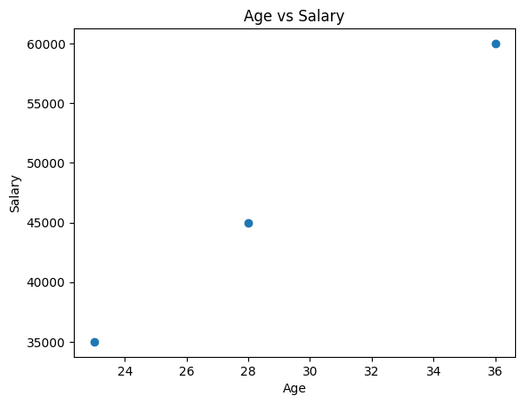
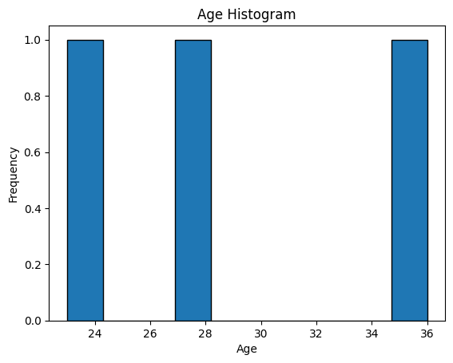

* Creating a SparkSession and SparkContext
(ex. spark = SparkSession.builder.appName("XXX").getOrCreate())

----------------------------------------------------------------------------------------------------
* Loading data from various sources (e.g., CSV, JSON, Parquet)
(ex. data = spark.read.csv("XXX.csv", header = True, inferSchema = True))

----------------------------------------------------------------------------------------------------
* Performing basic data transformations (e.g., filtering, mapping, reducing)
(ex. import matplotlib.pyplot as plt 
    import pandas as pd 

    pd_df = df.toPandas()
    plt.scatter(pd_df["Age"], pd_df["Salary"])
    plt.xlabel("Age")
    plt.ylabel("Salary")
    plt.title("Age vs Salary")
    plt.show()
)

----------------------------------------------------------------------------------------------------
(ex. histogram

plt.hist(pd_df["Age"], bins = 10, edgecolor = "black")
plt.xlabel("Age")
plt.ylabel("Frequency")
plt.title("Age Histogram")
plt.show()
)

----------------------------------------------------------------------------------------------------
* Using DataFrames and Datasets for data manipulation
(ex. data = [
    ("Alice", 28, 45000), 
    ("Bob", 36, 60000),                 
    ("Cathy", 23, 35000)
])
df = spark.createDataFrame(data, ["Name", "Age", "Salary"])

summary_stats = df.describe(["Age", "Salary"])
summary_stats.show()

-> +-------+--------------+------------------+
|summary|           Age|            Salary|
+-------+--------------+------------------+
|  count|             3|                 3|
|   mean|          29.0|46666.666666666664|
| stddev|6.557438524302|12583.057392117917|
|    min|            23|             35000|
|    max|            36|             60000|
+-------+--------------+------------------+
----------------------------------------------------------------------------------------------------
(ex. Data manipulation

from pyspark.sql.functions import col
df_transformed = df.withColumn("Increased_Salary", col("Salary") * 1.1)
df_transformed.show()

+-----+---+------+-----------------+
| Name|Age|Salary| Increased_Salary|
+-----+---+------+-----------------+
|Alice| 28| 45000|49500.00000000001|
|  Bob| 36| 60000|          66000.0|
|Cathy| 23| 35000|          38500.0|
+-----+---+------+-----------------+

from pyspark.sql.functions import concat, lit
df_transformed = df.withColumn("Modified_Name", concat(col("Name"), lit("- Employee")))
df_transformed.show()

+-----+---+------+---------------+
| Name|Age|Salary|  Modified_Name|
+-----+---+------+---------------+
|Alice| 28| 45000|Alice- Employee|
|  Bob| 36| 60000|  Bob- Employee|
|Cathy| 23| 35000|Cathy- Employee|
+-----+---+------+---------------+

----------------------------------------------------------------------------------------------------
ex. Filter

df_filtered = df.filter(col("Age")>25)
df_filtered.show()

+-----+---+------+
| Name|Age|Salary|
+-----+---+------+
|Alice| 28| 45000|
|  Bob| 36| 60000|
+-----+---+------+
----------------------------------------------------------------------------------------------------
ex. finding average

from pyspark.sql.functions import avg
avg_salary = df.agg(avg(col("Salary"))).collect()[0][0]
print("Average Salary: ", avg_salary)
from pyspark.sql.functions import avg, max
grouped_data = df.groupBy("Age").agg(avg("Salary"), max("Salary"))
grouped_data.show()

+---+-----------+-----------+
|Age|avg(Salary)|max(Salary)|
+---+-----------+-----------+
| 28|    45000.0|      45000|
| 36|    60000.0|      60000|
| 23|    35000.0|      35000|
+---+-----------+-----------+

----------------------------------------------------------------------------------------------------
ex. adding prefix to name 

def add_prefix(name):
    return "Mr." + name

from pyspark.sql.functions import udf
from pyspark.sql.types import StringType
add_prefix_udf = udf(add_prefix, StringType())
df_with_prefix = df.withColumn("PrefixedName", add_prefix_udf("Name"))
df_with_prefix.show()

+-----+---+------+------------+
| Name|Age|Salary|PrefixedName|
+-----+---+------+------------+
|Alice| 28| 45000|    Mr.Alice|
|  Bob| 36| 60000|      Mr.Bob|
|Cathy| 23| 35000|    Mr.Cathy|
+-----+---+------+------------+

                                                                                
etc.......
)
----------------------------------------------------------------------------------------------------

* ml Supervised Learning 

spark = SparkSession.builder.appName("SupervisedLearning").getOrCreate()
data = [
    (1200, 2, 1, 150000),
    (1400, 3, 2, 200000),
    (1600, 4, 2, 250000),
    (1800, 5, 3, 300000),
    (2000, 6, 4, 350000),
    (2200, 7, 5, 400000),
    (2400, 8, 6, 450000),
    (2600, 9, 7, 500000),
    (2800, 10, 8, 550000),
]

from pyspark.sql.types import IntegerType
schema = StructType([
    StructField("Sqft", IntegerType(), True),
    StructField("Bedrooms", IntegerType(), True),
    StructField("Bathroom", IntegerType(), True),
    StructField("Price", IntegerType(), True)
])
df = spark.createDataFrame(data, schema)
df.show()

+----+--------+--------+------+
|Sqft|Bedrooms|Bathroom| Price|
+----+--------+--------+------+
|1200|       2|       1|150000|
|1400|       3|       2|200000|
|1600|       4|       2|250000|
|1800|       5|       3|300000|
|2000|       6|       4|350000|
|2200|       7|       5|400000|
|2400|       8|       6|450000|
|2600|       9|       7|500000|
|2800|      10|       8|550000|
+----+--------+--------+------+

----------------------------------------------------------------------------------------------------

* using ml logistic Regression
ex. "Only good when working with Binary 0 1 (i.e did this customer buy this item? yes(0) no(1))

from pyspark.ml.feature import VectorAssembler
from pyspark.ml.classification import LogisticRegression
from pyspark.ml import Pipeline

feature_columns = ["Sqft", "Bedrooms", "Bathroom"]
assembler = VectorAssembler(inputCols=feature_columns, outputCol="features")
df_assembled = assembler.transform(df)
train_data, test_data = df_assembled.randomSplit([0.8, 0.2])
lr = LogisticRegression(featuresCol="features", labelCol="Price")
model = lr.fit(train_data)
predictions = model.transform(test_data)
predictions.select("features", "Price", "prediction").show()

+----------------+------+----------+
|        features| Price|prediction|
+----------------+------+----------+
|[1600.0,4.0,2.0]|250000|  200000.0|
|[2000.0,6.0,4.0]|350000|  400000.0|
+----------------+------+----------+

----------------------------------------------------------------------------------------------------

* using ml linear Regression 
ex. "Great to use when dealing with continus number data (ie. 123141 blah blah blah)
from pyspark.ml.regression import LinearRegression
lr = LinearRegression(featuresCol="features", labelCol="Price")
model = lr.fit(train_data)
predictions = model.transform(test_data)
predictions.select("features", "Price", "prediction").show()

+----------------+------+------------------+
|        features| Price|        prediction|
+----------------+------+------------------+
|[1600.0,4.0,2.0]|250000|249999.99999999878|
|[2000.0,6.0,4.0]|350000| 349999.9999999993|
+----------------+------+------------------+
----------------------------------------------------------------------------------------------------

* using ml clustering 

from pyspark.ml.clustering import KMeans
feature_columns = ["SpendingElectronics", "SpendingFashion", "SpendingGrocery"]
assembler = VectorAssembler(inputCols = feature_columns, outputCol= "features")
df_assembler = assembler.transform(df)
kmeans = KMeans(featuresCol="features", k = 3)
model = kmeans.fit(df_assembler)
predictions = model.transform(df_assembler)
predictions.select("CustomerID", "features", "prediction").show()

+----------+--------------------+----------+
|CustomerID|            features|prediction|
+----------+--------------------+----------+
|  Customer|[10000.0,5000.0,2...|         0|
|  Customer|[20000.0,7000.0,3...|         0|
|  Customer|[30000.0,9000.0,4...|         0|
|  Customer|[40000.0,11000.0,...|         0|
|  Customer|[50000.0,13000.0,...|         1|
|  Customer|[60000.0,15000.0,...|         1|
|  Customer|[70000.0,17000.0,...|         1|
|  Customer|[80000.0,19000.0,...|         1|
|  Customer|[90000.0,21000.0,...|         2|
|  Customer|[100000.0,23000.0...|         2|
+----------+--------------------+----------+
----------------------------------------------------------------------------------------------------

* using ml PCA 
pca = PCA(k=2, inputCol="features", outputCol="pca_features")
model = pca.fit(df_assembler)
df_pca = model.transform(df_assembler)
df_pca.select("CustomerID", "pca_features").show(truncate=False)

+----------+-----------------------------------------+
|CustomerID|pca_features                             |
+----------+-----------------------------------------+
|Customer  |[-10930.080817023569,-3055.0504633038913]|
|Customer  |[-21177.031582983167,-3055.050463303892] |
|Customer  |[-31423.98234894276,-3055.0504633038913] |
|Customer  |[-41670.93311490236,-3055.050463303892]  |
|Customer  |[-51917.88388086196,-3055.0504633038913] |
|Customer  |[-62164.83464682155,-3055.050463303891]  |
|Customer  |[-72411.78541278114,-3055.0504633038904] |
|Customer  |[-82658.73617874074,-3055.050463303892]  |
|Customer  |[-92905.68694470033,-3055.050463303891]  |
|Customer  |[-103152.63771065994,-3055.050463303891] |
+----------+-----------------------------------------+
----------------------------------------------------------------------------------------------------
